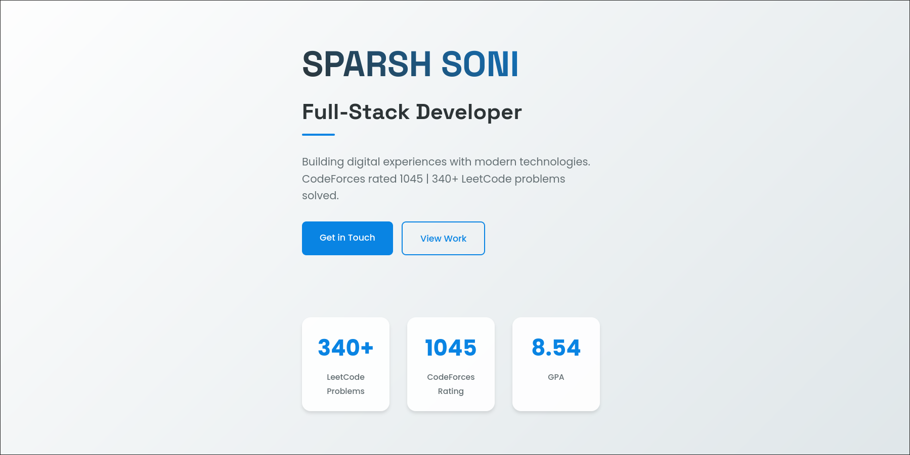

## Personal Portfolio Repository

This repository contains my personal portfolio, showcasing my projects, skills, and achievements. It serves as a comprehensive overview of my work and experiences in the field of computer science and web development.

## ⚡ Technologies Used

### Languages :

    
    
    

## Feel free to connect with me!

    
    

